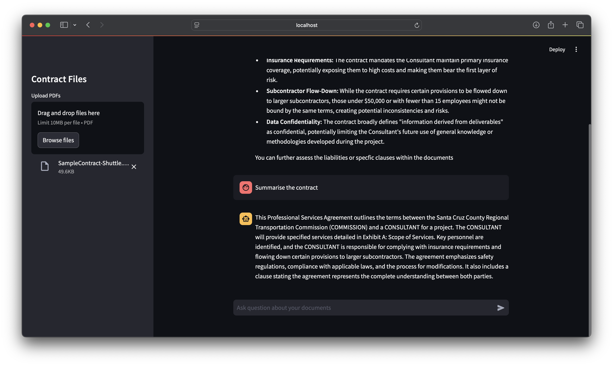

# PaperPal: AI-Powered Contract Navigator

**PaperPal** is a web application designed to help users navigate, review, and analyze PDF documents such as contracts using AI. The app uses retrieval-augmented generation (RAG) for question-answering tasks, leveraging Langchain, FAISS, and Google Generative AI to provide detailed insights from uploaded PDFs.
<br/><br/>


## Features

- Upload and analyze multiple PDF contracts
- AI-powered question answering based on document content
- Risk review of uploaded contracts
- Conversation history-aware retrieval and QA

## Technologies

- [Langchain](https://github.com/hwchase17/langchain)
- [FAISS](https://github.com/facebookresearch/faiss)
- [Google Generative AI](https://ai.google.dev)
- [Streamlit](https://streamlit.io)

## Usage Examples



## Setup

### Prerequisites

Ensure you have the following installed:

- Python
- [Streamlit](https://streamlit.io) (for running the web app)
- [FAISS](https://github.com/facebookresearch/faiss) (for vector search)

### Installation

1. Clone the repository:

   ```bash
   git clone https://github.com/your-username/paperpal.git
   cd paperpal
   ```
2. Create a virtual environment and activate it
   
   ```bash
   python3 -m venv .venv
   ource venv/bin/activate  # On Windows: venv\Scripts\activate
   ```
3. Install required dependencies
   
   ```bash 
   pip install -r requirements.txt
   ```
4. Set up your environment variables by creating a .env file in the root directory:
   ```bash
   GOOGLE_API_KEY=your_google_api_key
   ```

### Running the App
Once you have installed all dependencies and configured your environment:

1. Start the streamlit app
   ```bash
   streamlit run app.py
   ```
2. The app will be available at http://localhost:8501/